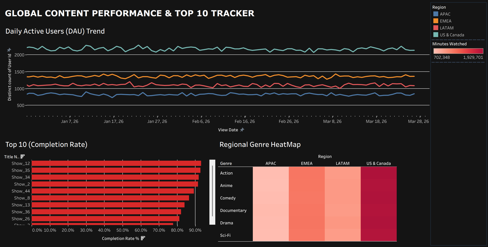

# Global Content Performance & "Top 10" Dashboard

## 📌 Project Overview
This repository contains a simulated end-to-end data analytics pipeline designed to mimic enterprise streaming operations. The objective of this project is to architect a relational database schema, process massive volumes of streaming data using advanced SQL, and visualize core business metrics—such as Daily Active Users (DAU) and title completion rates—in an interactive BI dashboard.

## 🛠️ Tech Stack
* **Data Generation:** Python (Pandas, NumPy)
* **Database & Querying:** MySQL 8.0 (CTEs, Window Functions)
* **Data Visualization & BI:** Tableau Desktop

## 📊 Dataset Overview
The dataset was synthetically generated using Python to simulate a realistic, large-scale streaming environment. It includes built-in logic for content "Hits" and "Flops" to create realistic distribution curves for completion rates.
* **Total Logs Processed:** 500,000 viewing records
* **User Base:** 50,000 unique simulated users
* **Dimensions:** 4 global regions (APAC, EMEA, LATAM, US & Canada), 6 genres, 50 unique titles.
* **Total Watch Time Analyzed:** ~516,000 hours

## 📂 Repository Files
1. `generate_streaming_logs.py`: The Python script used to generate the 500,000-row `global_streaming_logs.csv` dataset, complete with weighted regional distribution and conditional watch-time logic.
2. `top_10_analysis.sql`: The MySQL script containing the schema creation and advanced queries.
    * **Query 1:** Utilizes Common Table Expressions (CTEs) and date aggregations to calculate Daily Active Users (DAU) and total hours watched per region.
    * **Query 2:** Utilizes the `DENSE_RANK()` Window Function and percentage calculations to isolate the top 10 highest-performing titles based on a 30-day completion rate.
3. `Dashboard_Screenshot.png`: A high-resolution export of the final Tableau dashboard.

## 📈 Executive Dashboard (Tableau)
The final deliverable is an interactive Tableau dashboard designed for content strategy teams. It provides a clean, accessible layout tracking week-over-week streaming metrics, regional genre popularity (Heatmap), and the dynamic "Top 10" algorithm ranking. 

*(Make sure to upload your clean, light-mode screenshot to your repository and name it `Dashboard_Screenshot.png` so it appears right here!)*

## 💡 Key Business Insights
* Successfully ingested and structured a half-million row dataset into a relational MySQL environment.
* Optimized queries to identify the platform's highest-performing titles, which achieved **>88% completion rates**.
* Visualized regional anomalies, allowing simulated operations teams to detect localized content trends instantly.
